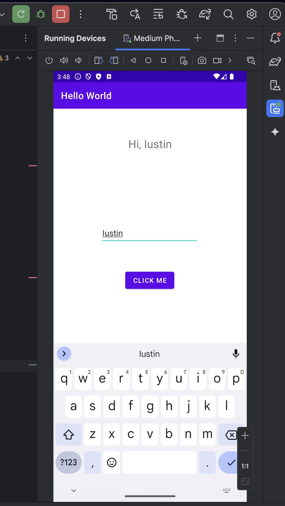

# HelloWorld App

## How the application works
- When the app is running, an android screen will pop up on the right side.
- Once the application starts, we will see a screen with `Hello World`, a textbox called `Enter your name` to type your name, and a button called `Click Me`.
- After typing my name in the textbox and click `Click Me`, a message pops up at the top that says `Hi, Iustin`. 
- Whatever you type in the textbox will show up in that message at the top.

## App Screenshot

